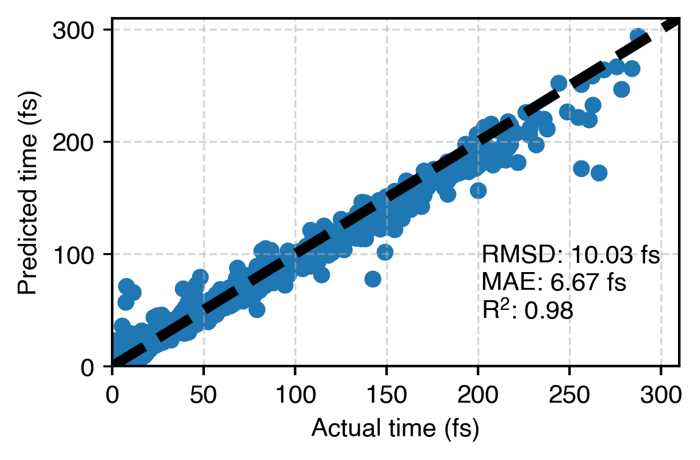
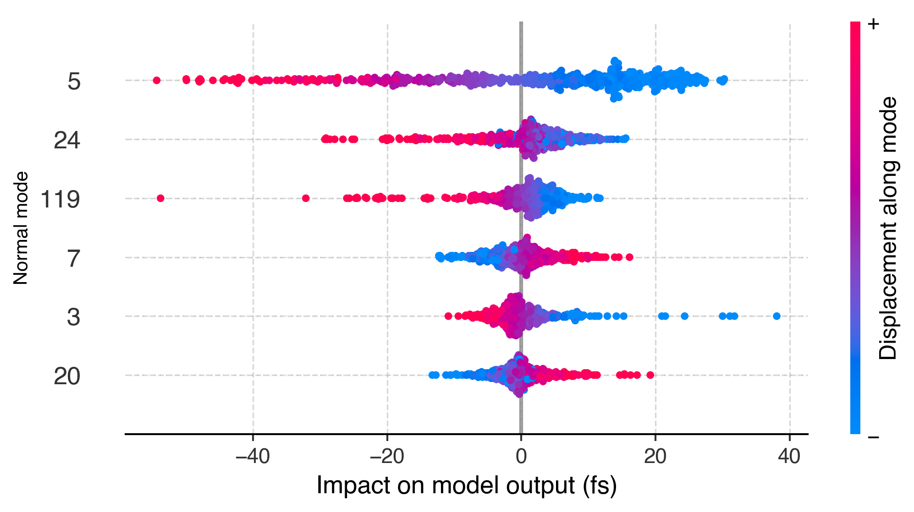

**`chem_interp`**: use interpretable machine learning to explain complicated chemical reactions!

<p align="center">
<a></a>
</p>

Usually molecular dynamics has so much information, it's tough to make sense of it all. But what if 
you could have a computer help you figure out what's really going on? That's the idea here -- have 
the computer learn what molecular motions lead to chemical reactions, and then distill this knowledge
in a way humans can understand. First the computer learns, then it teaches.

Code was used in this paper: 
> Goings, J. J.; Hammes-Schiffer, S. [Nonequilibrium Dynamics of Proton-Coupled Electron Transfer in Proton Wires: Concerted but Asynchronous Mechanisms.](https://doi.org/10.1021/acscentsci.0c00756) ACS Cent Sci 2020, 6 (9), 1594–1601.

Big-picture overview:
1. Fit neural network to **predict** proton transfer times from *ab initio* molecular dynamics.
2. Use interpretable ML methods to **explain** what molecular motions led to proton transfer.

<table><tr>
  <td>  <b>Predict</b> </td>
<td>  <b>Explain</b? </td>
</tr></table>

Top level has code for training the neural network. Once the model is trained, there are two types
of approaches for explaining the model in `explanations`: permutation importance and SHAP (SHapley Additive exPlanations).

Permutation importance is subtractive -- it tells you how much your model breaks when you scramble the data for that particular feature.

SHAP is additive -- it tells you how much a feature contributed to a model prediction.

If the two approaches identify features as being important, there's probably good reason to investigate further.

Directory structure:
```
.
├── README.md
├── 1-prepare_model.py
├── 2-keep_training.py
├── 3-evaluate_model.py
├── data
│   ├── 1-split_data.py
│   ├── 2-scale_data.py
│   ├── processed
│   ├── raw
│   └── split_raw
├── figures
├── model
├── explanations
│   ├── permutation_importance
│   │   ├── 1-run_permutation_importance.py
│   │   ├── 2-plot_permutation_importance.py
│   │   ├── data
│   │   └── figures
│   └── shap
│       ├── 1-run_shap_explainer.py
│       ├── 2-plot_mode_impact_scatter.py
│       ├── 3-plot_mode_impact_magnitude.py
│       ├── 4-plot_impact_vs_displacement.py
│       ├── data
│       └── figures
└── utils.py
```
